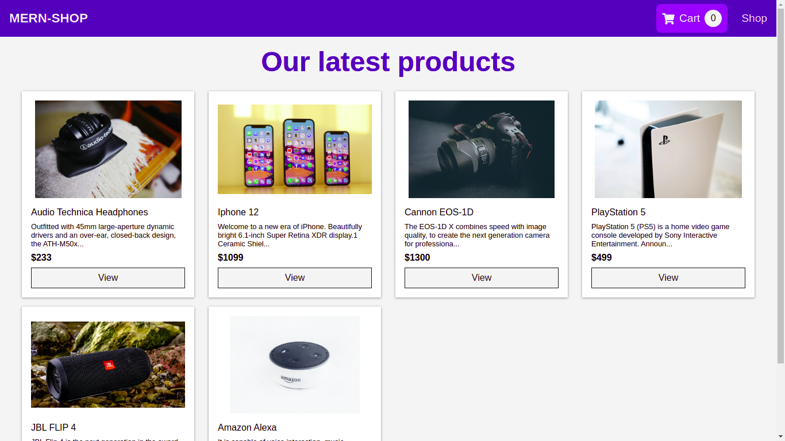

# mern-shop
E-shop build on MERN stack.
[Check out the deployed site](https://mern-super-shop.herokuapp.com/)

## Core Packages

1. redux - state management
2. mongoose - executing graphql queries and mutations
3. react-router - routing
4. express - for simple api

## Features

- Cart
- Product View
- api

## How to setup locally

- Create a .env file at the root directory
- Make sure you have these variables setup

```js
NODE_ENV=<DEV_ENDPOINT>/<PRODUCTION_ENDPOINT>
MONGODB_URI=<YOUR_MONGODB_URI>
```

- Then run <code>npm install && npm start dev</code> .

## Home


